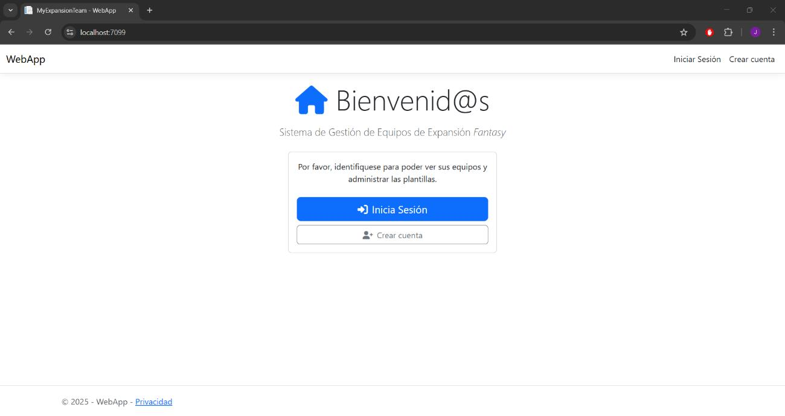
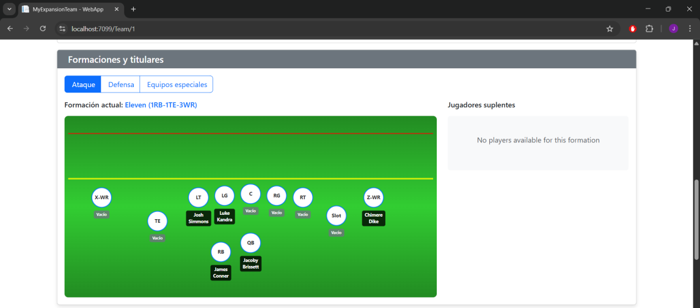
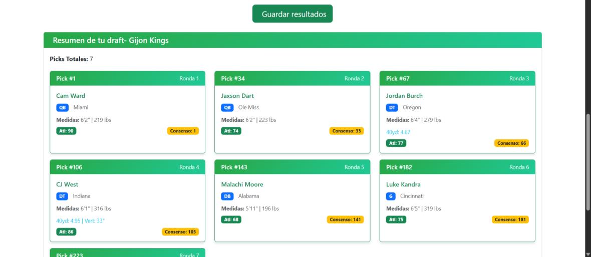
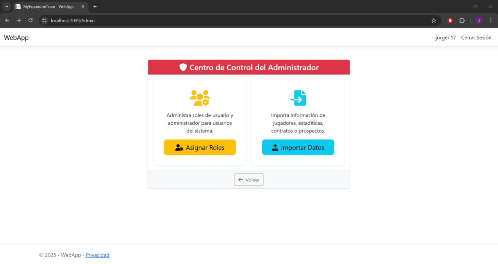
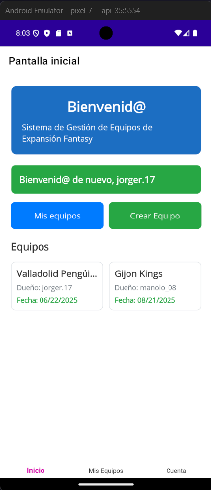

# My Expansion Team

### Simulador de Expansión de la NFL — Aplicación Full-Stack Web y Móvil

My Expansion Team es una aplicación full-stack que simula el proceso de creación y gestión de una franquicia de expansión de la NFL.

La aplicación permite a los usuarios crear sus propios equipos de expansión y construir sus plantillas siguiendo reglas configurables inspiradas en el proceso real de expansión de la NFL. Los usuarios pueden seleccionar jugadores protegidos, adquirir jugadores de franquicias existentes, gestionar contratos y restricciones de límite salarial, realizar trueques, llevar a cabo drafts, configurar reglas de plantilla y hacer seguimiento del rendimiento del equipo.

El proyecto fue desarrollado como mi **Trabajo de Fin de Grado (TFG) en Ingeniería Informática** e implementado como un sistema multicliente completo formado por una API REST, una aplicación web y una aplicación móvil.

---

## Visión general

A diferencia de las aplicaciones Fantasy tradicionales, My Expansion Team se centra en el **proceso de expansión de franquicias de la NFL**.

La aplicación ofrece un entorno completo en el que los usuarios pueden:

- Crear y gestionar franquicias de expansión
- Configurar reglas de expansión y de plantilla
- Seleccionar jugadores protegidos de franquicias existentes
- Adquirir jugadores de equipos existentes
- Construir y gestionar plantillas
- Configurar formaciones ofensivas y defensivas
- Gestionar contratos y restricciones de límite salarial
- Realizar trueques
- Llevar a cabo un draft de expansión
- Hacer seguimiento del rendimiento de equipos y jugadores
- Importar y gestionar datos de la NFL
- Gestionar cuentas de usuario y permisos

Todas estas funcionalidades están completamente implementadas y son funcionales — no son maquetas de interfaz.

---

# Puesta en marcha

Solo para desarrollo local — el proyecto no está desplegado en un entorno público.

**Requisitos:** Visual Studio 2022 (carga de trabajo .NET MAUI para móvil), .NET 9 SDK, SQL Server 2019/2022, SSMS.

```bash
# API REST
cd MyExpansionTeam
dotnet run
# → https://localhost:7087/swagger

# Aplicación web
cd WebApp
dotnet run
# → https://localhost:7099
```

Para la aplicación móvil, abre `METAPI.sln` en Visual Studio, establece `MobileApp` como proyecto de inicio y ejecútala sobre un emulador de Android.

Configuración completa de la base de datos e instrucciones de instalación paso a paso disponibles bajo petición.

---

# Capturas de pantalla

| | |
|---|---|
| **Inicio** | **Editor de alineaciones** |
|  |  |
| **Resumen del draft** | **Panel de administrador** |
|  |  |

**Móvil**



Más pantallas (registro, gestión de cuenta, trueques, importación de datos y el flujo completo de la aplicación móvil) disponibles bajo petición.

---

## Funcionalidades principales

### Gestión de equipos de expansión

Los usuarios pueden crear y gestionar sus propias franquicias de expansión.

- Crear equipos con nombre, localización y abreviatura
- Modificar equipos existentes
- Duplicar equipos como punto de partida para nuevas franquicias
- Eliminar equipos
- Ver información del equipo
- Gestionar múltiples equipos propios

### Reglas de expansión y gestión de plantilla

La aplicación modela las principales reglas implicadas en la construcción de una franquicia de expansión.

- Configurar ajustes de expansión
- Definir el número de jugadores protegidos
- Definir límites de adquisición de jugadores
- Seleccionar jugadores protegidos
- Adquirir jugadores de franquicias existentes
- Construir plantillas personalizadas
- Configurar formaciones ofensivas y defensivas
- Validar restricciones de plantilla

### Límite salarial y contratos

La información salarial y contractual se incorpora al proceso de construcción del equipo.

La aplicación aplica restricciones de límite salarial al construir y gestionar equipos, permitiendo que el proceso de expansión tenga en cuenta las restricciones financieras en lugar de tratar a los jugadores como simples entradas de plantilla.

### Trueques

Los usuarios pueden simular trueques de jugadores entre equipos.

- Seleccionar los jugadores implicados en un trueque
- Validar la información del trueque
- Ejecutar y guardar trueques
- Ver el historial de trueques asociado a un equipo

### Draft

La aplicación incluye un sistema de draft para equipos de expansión.

- Configurar ajustes del draft
- Gestionar selecciones del draft
- Seleccionar prospectos
- Guardar resultados del draft
- Revisar información del draft

### Datos de jugadores y rendimiento

El sistema gestiona información y estadísticas detalladas de jugadores de la NFL.

Incluye datos que cubren áreas como:

- Información del jugador
- Contratos
- Estadísticas de pase
- Estadísticas de carrera
- Estadísticas de recepción
- Otras estadísticas de rendimiento
- Información de equipos y franquicias

### Importación de datos

La aplicación incluye un sistema dedicado de importación de datos para cargar información de la NFL desde archivos CSV.

El pipeline de importación:

- Analiza los datos de entrada
- Valida los registros
- Detecta datos incompletos o inválidos
- Detecta registros duplicados
- Genera los objetos de dominio correspondientes
- Persiste la información resultante en la base de datos

La implementación utiliza tipos genéricos y herencia para soportar distintos tipos de datos importados a través de un flujo de importación común.

El conjunto de datos principal utilizado durante el desarrollo se obtuvo de **Kaggle**, con ESPN y OverTheCap como fuentes complementarias para información específica de la NFL.

### Gestión de usuarios y seguridad

El sistema incluye funcionalidad de autenticación y autorización.

- Registro de usuario
- Inicio y cierre de sesión
- Gestión de credenciales
- Perfiles de usuario
- Eliminación de cuenta
- Autorización basada en roles
- Gestión administrativa de usuarios

La API REST utiliza **autenticación JWT Bearer**, mientras que la aplicación web gestiona su propia sesión de usuario autenticada.

---

# Arquitectura

La aplicación fue diseñada como un sistema multicliente en torno a una API REST central.

```text
                                 ┌─────────────────────────┐
                                 │     Aplicación Web      │
                                 │     ASP.NET Core MVC    │
                                 └────────────┬────────────┘
                                              │
                                              │ HTTP
                                              │
┌─────────────────────────┐                   ▼
│   Aplicación Móvil      │      ┌─────────────────────────┐
│        .NET MAUI        │ ──▶ │         API REST        │
│         MVVM            │      │       ASP.NET Core      │
└─────────────────────────┘      └────────────┬────────────┘
                                              │
                                              ▼
                                 ┌─────────────────────────┐
                                 │    Capa de Negocio      │
                                 │         METCore         │
                                 └────────────┬────────────┘
                                              │
                                              ▼
                                 ┌─────────────────────────┐
                                 │  Capa de Acceso a Datos │
                                 │         METDAL          │
                                 │    EF Core + Repos.     │
                                 └────────────┬────────────┘
                                              │
                                              ▼
                                 ┌─────────────────────────┐
                                 │       SQL Server        │
                                 └─────────────────────────┘
```

La arquitectura separa presentación, lógica de negocio y acceso a datos, permitiendo que múltiples clientes consuman la misma API y la misma lógica de negocio subyacente.

Ambos clientes consumen el mismo backend a través de HTTP en lugar de duplicar la lógica de negocio.

---

# Estructura de la solución

La solución está dividida en cinco proyectos:

```text
MyExpansionTeam/
│
├── MyExpansionTeam/
│   └── API REST
│
├── METCore/
│   ├── Modelos de dominio
│   ├── DTOs
│   ├── Interfaces de servicio
│   ├── Servicios de negocio
│   └── Mapping
│
├── METDAL/
│   ├── Entity Framework Core
│   ├── Contexto de base de datos
│   ├── Configuración de entidades
│   ├── Repositorios
│   └── Migraciones de base de datos
│
├── WebApp/
│   ├── ASP.NET Core MVC
│   ├── Controladores
│   ├── Vistas
│   └── Comunicación HTTP/AJAX con la API
│
└── MobileApp/
    ├── .NET MAUI
    ├── MVVM
    ├── Vistas
    └── Comunicación HTTP con la API
```

### MyExpansionTeam

La API REST de ASP.NET Core encargada de exponer la funcionalidad de la aplicación mediante endpoints REST.

La API contiene controladores que cubren los principales dominios de la aplicación, incluyendo usuarios, equipos, jugadores, franquicias, trueques, drafts y datos relacionados.

### METCore

El núcleo compartido de la aplicación.

Contiene:

* Modelos de dominio
* Data Transfer Objects (DTOs)
* Interfaces de servicio
* Lógica de negocio
* Configuración de mapping

Esta capa proporciona los contratos y la lógica comunes utilizados en toda la solución.

### METDAL

La capa de acceso a datos.

Es responsable de la comunicación con SQL Server a través de Entity Framework Core e implementa la arquitectura de acceso a datos basada en el patrón Repository.

### WebApp

El cliente web implementado con ASP.NET Core MVC.

La aplicación web se comunica con la API REST a través de HTTP y proporciona la experiencia web completa para el usuario.

### MobileApp

El cliente móvil implementado con .NET MAUI.

La aplicación sigue el patrón MVVM y se comunica con la misma API REST utilizada por el cliente web.

---

# Stack tecnológico

## Backend

* **C#**
* **ASP.NET Core Web API**
* **.NET 9**
* **Entity Framework Core**
* **AutoMapper**
* **Autenticación JWT Bearer**
* **Swagger / OpenAPI**

## Web

* **ASP.NET Core MVC**
* **Razor**
* **HTML / CSS**
* **JavaScript**
* **AJAX**
* **HTTP Client**

## Móvil

* **.NET MAUI**
* **XAML**
* **C#**
* **MVVM**

## Base de datos

* **Microsoft SQL Server**
* **Entity Framework Core**
* **SQL Server Management Studio**
* Migraciones de base de datos
* Procedimientos almacenados

## Herramientas de desarrollo

* **Visual Studio**
* **Postman**
* **Git / GitHub**

---

# Base de datos

Microsoft SQL Server se utiliza como base de datos relacional de la aplicación.

La base de datos modela las distintas entidades implicadas en la simulación de expansión de la NFL, incluyendo usuarios, franquicias, equipos, jugadores, contratos, estadísticas, drafts y trueques.

Entity Framework Core se utiliza para el mapeo objeto-relacional y el acceso a datos.

El proyecto también hace uso de procedimientos almacenados para operaciones de base de datos y consultas más complejas.

El modelo de datos resultante contiene más de 15 entidades especializadas para distintas categorías de información y estadísticas de la NFL.

---

# API REST

La API REST actúa como backend central para ambas aplicaciones cliente.

Áreas representativas de la API:

```text
/api/Auth
/api/Users
/api/Players
/api/Franchises
/api/Teams
```

Las operaciones relacionadas con equipos incluyen:

* Creación y actualización de equipos
* Obtención de información del equipo
* Gestión de plantillas
* Configuración de ajustes de plantilla
* Realización de trueques
* Guardado de resultados del draft
* Obtención del historial de trueques del equipo
* Duplicado de equipos
* Eliminación de equipos

La API utiliza DTOs para definir los datos intercambiados con los clientes y separa los contratos de la API de las entidades de base de datos subyacentes.

Swagger/OpenAPI está disponible durante el desarrollo para explorar y probar la API.

---

# Modelo de datos

La aplicación trabaja con un modelo de dominio de la NFL relativamente complejo, en lugar de un pequeño conjunto de entidades CRUD genéricas.

La base de datos representa distintos tipos de información, como:

* Usuarios
* Franquicias
* Equipos
* Jugadores
* Contratos
* Prospectos de draft
* Selecciones de draft
* Trueques
* Plantillas de equipo
* Estadísticas de pase
* Estadísticas de carrera
* Estadísticas de recepción
* Otras estadísticas de temporada

Esto requirió traducir reglas y conceptos específicos de la NFL a un modelo de datos relacional y a la lógica de aplicación correspondiente.

---

# Arquitectura de importación de datos

Uno de los componentes técnicamente más elaborados del proyecto es el pipeline de importación de datos.

La aplicación acepta conjuntos de datos en CSV y los procesa mediante un flujo de importación común.

Conceptualmente:

```text
Archivo CSV
   │
   ▼
Lectura y parseo
   │
   ▼
Validación de datos
   │
   ├── Registros inválidos
   ├── Registros incompletos
   └── Registros duplicados
   │
   ▼
Generación de objetos de dominio
   │
   ▼
Persistencia de datos
   │
   ▼
SQL Server
```

La implementación utiliza genéricos y herencia para permitir que distintos tipos de datos importados se procesen mediante el mismo flujo general, generando en cada caso los objetos de dominio adecuados.

---

# Autenticación y autorización

La autenticación se implementa mediante tokens JWT Bearer a nivel de API.

El sistema también implementa autorización basada en roles de usuario, permitiendo restringir la funcionalidad administrativa a usuarios autorizados.

La aplicación web mantiene su propia sesión de usuario autenticada mientras utiliza la API como backend.

---

# Pruebas

La aplicación se probó de forma extensiva mediante casos de prueba funcionales derivados de los casos de uso definidos en el sistema.

Las pruebas cubrieron áreas como:

* Registro de usuario
* Autenticación
* Cierre de sesión
* Gestión de credenciales
* Creación y gestión de equipos
* Gestión de plantillas
* Protección de jugadores
* Selección de jugadores
* Trueques
* Drafts
* Configuración del draft
* Seguimiento de rendimiento
* Importación de datos
* Funcionalidad administrativa
* Gestión de roles

Las pruebas incluyeron tanto escenarios correctos como inválidos, como entradas incompletas, credenciales inválidas, datos duplicados, operaciones inválidas y cancelación de procesos.

---

# Enfoque de desarrollo

El proyecto siguió el **Proceso Unificado (PU)** como metodología de desarrollo de software.

La metodología se eligió por su:

* Naturaleza iterativa e incremental
* Enfoque centrado en la arquitectura
* Desarrollo dirigido por casos de uso
* Capacidad de adaptarse a cambios durante el desarrollo

El proceso de desarrollo cubrió:

1. Captura de requisitos
2. Análisis
3. Diseño del sistema
4. Diseño de arquitectura y base de datos
5. Selección de tecnologías
6. Implementación e integración
7. Pruebas
8. Documentación

---

# Documentación del proyecto

Este proyecto fue desarrollado como mi **Trabajo de Fin de Grado (TFG)** en Ingeniería Informática.

La memoria completa documenta los requisitos, el análisis, la arquitectura, el diseño de la base de datos, la implementación, las pruebas, las conclusiones, las posibles líneas futuras de desarrollo y los manuales de instalación y usuario.

La memoria/documentación completa está disponible bajo petición.

La memoria contiene información técnica detallada que deliberadamente no se duplica por completo en este README.

---

# Líneas futuras

El repositorio actual representa la versión completada del Trabajo de Fin de Grado y no está pensado para seguir desarrollándose de forma activa.

La memoria identificó varias posibles líneas futuras, entre ellas:

* Funcionalidades sociales e interacción entre usuarios
* Ligas Fantasy avanzadas
* Clasificaciones y sistemas competitivos
* Estadísticas y contenido adicional
* Expansión a otros deportes como NBA, MLB y NHL
* Integración de datos en tiempo real
* Plataformas adicionales
* Mejoras adicionales de escalabilidad

Estas posibilidades están documentadas en detalle en el TFG.

---

# Estado del proyecto

**Completado — Trabajo de Fin de Grado / Proyecto de portfolio**

Este repositorio contiene la versión final del proyecto presentado como mi Trabajo de Fin de Grado.

La aplicación es totalmente funcional en sus clientes web y móvil, y se presenta como un proyecto de portfolio que demuestra el desarrollo completo de una aplicación full-stack multicliente.

Actualmente no está desplegada como un servicio en producción de acceso público.

---

# Autor

**Jorge Rodríguez Rodríguez**

Graduado en Ingeniería Informática · Desarrollador Full-Stack

Áreas de interés:

* Desarrollo Full-Stack
* Desarrollo Backend
* .NET / ASP.NET Core
* Diseño de APIs REST
* Arquitectura de Software
* Diseño de Bases de Datos
* C#
